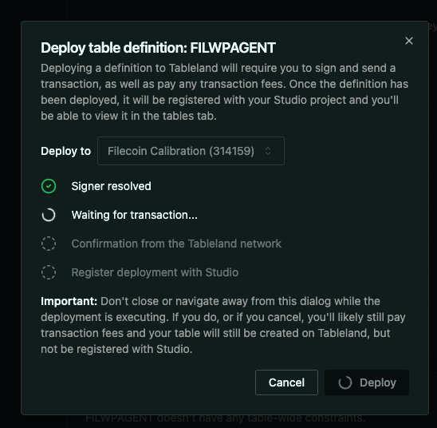

# FILWPAgent: Fair AI Agent for WordPress Creators

## Problem
WordPress powers approximately 43–44% of all websites worldwide as of mid-2025,in the CMS market, WordPress holds a dominant 61–63% share. AI companies are scraping content from WordPress for free. At the same time, AI systems cannot prove they are using content legally or compensating creators.

## Idea

FILWPAgent is a plugin+AiAgentServiece that transforms your WordPress site into immutable record log with filecoin Network Storage and enables a fair, transparent, and decentralized content economy for the AI era.

NOTE: At present our Wordpress plugin is under review so we cloned wordpress locally and uploaded plugin via zip file..
> **NOTE:** Our WordPress plugin is currently **under review**.  
> In the meantime, we have cloned WordPress locally and uploaded the plugin manually via a zip file.
Checkout our - [Plugin Repo](https://github.com/Mano-08/wallet-payment-gaurd)

## How It Works

1. **WordPress Plugin for Creators:**
   - WordPress owners install our plugin and set their wallet address and desired payment amount(*USDFC stablecoin*) for each blog post and click on monitize Button in dashboard.
   - The plugin submits blog metadata (title, summary, tags, wallet, amount, etc.) to our FILWPAgent

2. **Decentralized Content Registry:**
   - FILWPAgent inserts the content metadata into a Tableland decentralized database (onchain SQLite table) and deploy smart Contract
   - This creates an immutable, auditable record of all content available for AI access.

3. **User Platform & Payment:**
   - Users visit our platform and search for topics.
   - If relevant content is found in Tableland Database via sql query operations without using centralized database, users can pay the creator's specified amount (in USDFC) for purchasing Content
    Filecoin network stablecoin) calls to smart contract on filecoin Network to access the full content and happily receive content.
   - Payment and access are handled onchain, ensuring transparency and fair compensation.

## Future Plans
- Our WordPress plugin is currently in the approval queue (position #422) on the official WordPress plugin directory.

### PLUGIN REVIEW UNDER WORDPRESS 

- We plan to launch on Filecoin mainnet soon, bringing decentralized, fair content monetization to a global audience.

---

**FILWPAgent: Empowering creators, enabling fair AI, and building the future of the web content economy.**

---

## Gallery

### Agent SQL Query Example

### Tableland SQLite Dashboard

### FILWPAgent Tableland Integration

