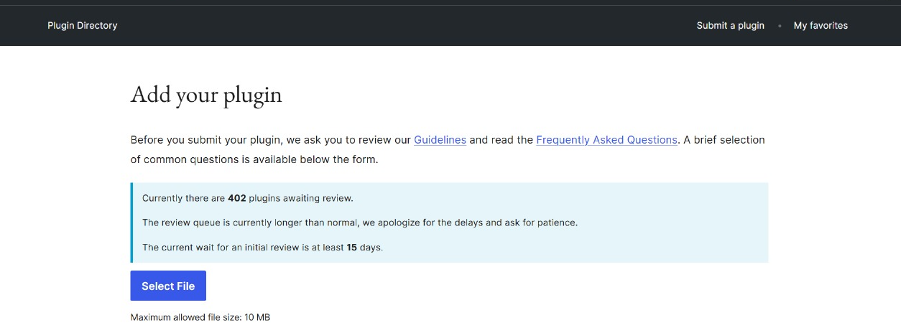
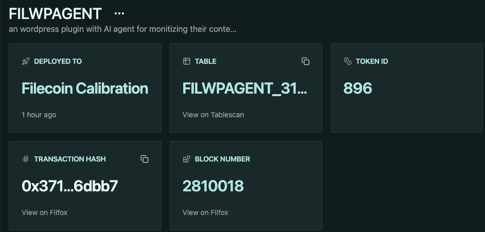
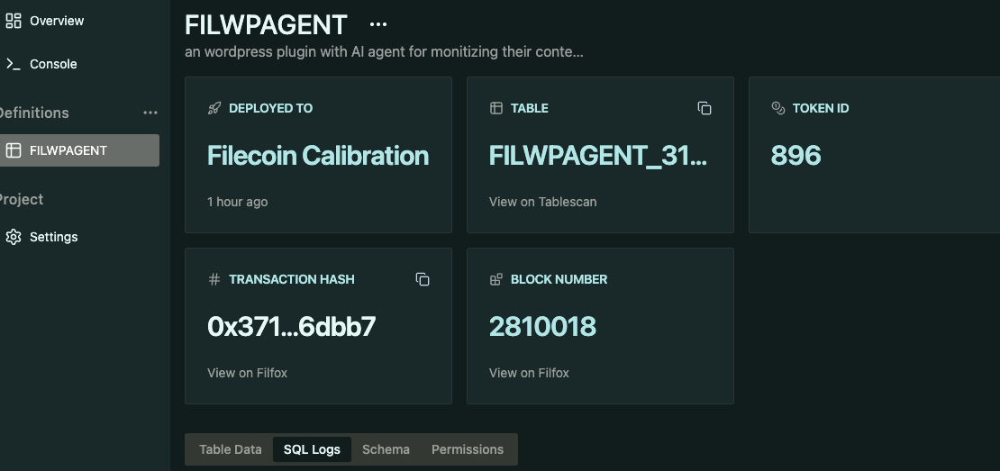
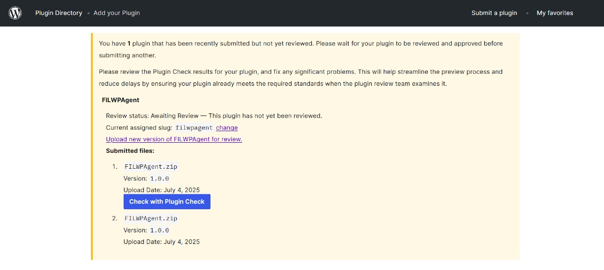

# FILWPAgent: Fair AI Agent for WordPress Creators

## Problem
WordPress powers approximately 43–44% of all websites worldwide as of mid-2025,in the CMS market, WordPress holds a dominant 61–63% share. AI companies are scraping content from WordPress for free. At the same time, AI systems cannot prove they are using content legally or compensating creators.

## Idea

FILWPAgent is a plugin+AiAgentServiece that transforms your WordPress site into immutable record log with filecoin Network Storage and enables a fair, transparent, and decentralized content economy for the AI era.

> **NOTE:** Our WordPress plugin submitted is currently **under review**.  
> In the meantime,we cloned Wordpress, running locally through apache server and uploaded plugin via zip file.
Checkout our - [Plugin Repo](https://github.com/Mano-08/wallet-payment-gaurd)

## How It Works

1. **WordPress Plugin for Creators:**
   - WordPress owners install our plugin and set their wallet address and desired payment amount(*USDFC stablecoin*) for each blog post and click on monetize button under each blog post.
   - The plugin submits blog metadata (title, summary, tags, wallet, amount, etc.) to our FILWPAgent

2. **Decentralized Content Registry:**
   - FILWPAgent inserts the content metadata into a Tableland decentralized database (onchain SQLite table) and deploy smart Contract
   - This creates an immutable, auditable record of all content available for AI access Logs

3. **User Platform & Payment:**
   - Users visit our platform and search for topics.
   - If relevant content is found in Tableland Database via sql query operations without using centralized database, users can pay the creator's specified amount (in USDFC) for consuming Content
   - After calls to smart contract on Filecoin Network to access the full content and happily receive the content according to user query.
   - Payment and access are handled onChain with smart contracts, ensuring transparency.

## Future Plans
- Our WordPress plugin is currently in the approval queue (position #402) on the official WordPress plugin directory.

### PLUGIN REVIEW UNDER WORDPRESS 

- We plan to launch on Filecoin mainnet soon with USDFC payments, bringing decentralized, fair content monetization to a global audience.
- Optimize our Agent Search Engine, to rewards the best creators for the user query by indexing with a Ranking algorithm.

---

**FILWPAgent: Empowering creators, enabling fair AI, and building the future of the web content economy.**

---

## Gallery

### Agent SQL Query Example

### Tableland SQLite Dashboard

### Plugin Under Review

 